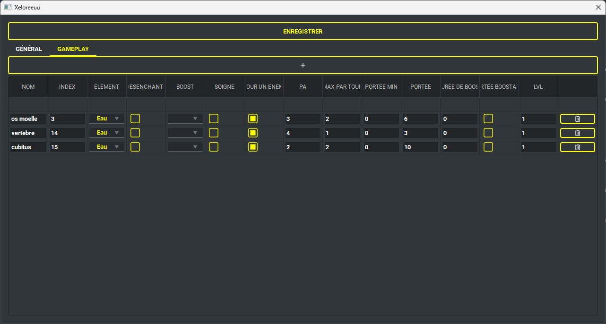
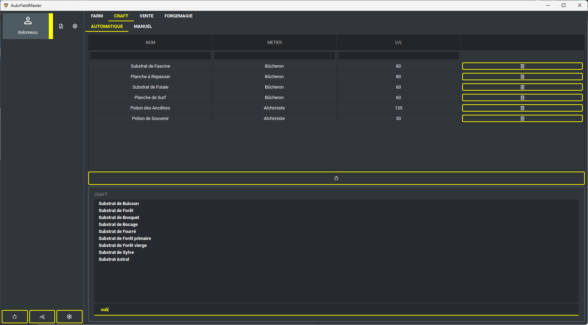
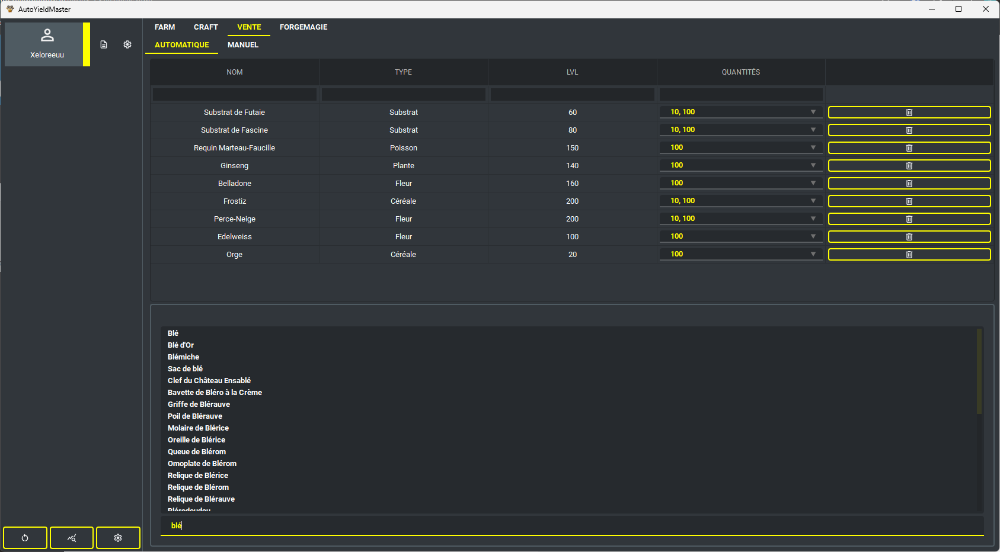
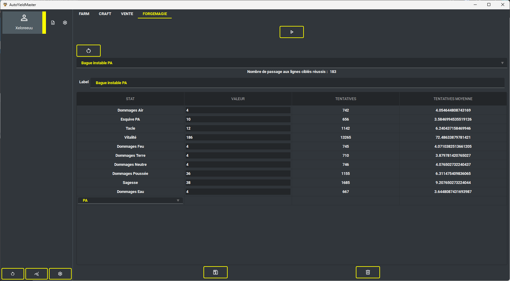
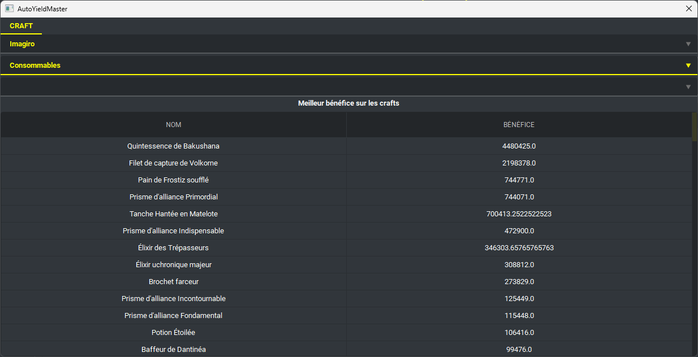

### Présentation

D2Pixel est un bot full pixel, il ne marche qu'a travers l'analyse d'image et la simulation de clique, il marche en arrière plan sauf si vous voulez farmer les monstres à travers le mode combat.

Le bot peux :
- Farmer les ressources récoltables des métiers:
  - Paysan
  - Bucheron
  - Alchimiste
  - Pêcheur
- Craft à travers les métiers:
  - Paysan
  - Bucheron
  - Alchimiste
  - Pêcheur
- Vendre des ressources ou des consommables
- Automatiser la forgemagie d'exo

Le mode farm est codé de sorte à ce que le bot soit autonome malgré les erreurs, les morts, le fait qu'il soit full pods.

En lancant le bot vous n'aurez qu'a remplir les informations du bot :
- Niveau
- Élement
- Serveur
- Zaaps disponible
- Niveau des métiers
- Les sorts (index: 0 veux dire première colonne et première ligne de la barre de sort)

_Exemple de configuration pour les sorts_ :

_Interfaces :_

### Pré-requis
- Windows 11/10/8 (je n'ai pas testé pour d'autre version de windows mais ça devrait marcher)
- Afficher la barre des pods
- Connexion au choix de personnage
- Anticrénélage: aucun
- Limite de passage en mode créature: aucun
- Ne pas cocher afficher les personnages en transparence
- Afficher les coordonnées de la carte
- Mode tactique
- Ne pas cocher utiliser le mode tactique coloré
- Ne pas cocher afficher les cartes adjacentes
- Ne pas cocher afficher tous les monstres d'un groupe
- Mise à l'echelle 100% paramètre affichage pc
- Résolution 1920x1080
- Ne pas avoir d'écran dupliquer

### Jeu
- Ne pas être dans le tutoriel
- Etre abonné
- Avoir le zaap de bonta

### Télécharger la dernière version

https://github.com/Valentin-alix/AutoYieldMaster/releases/download/0.1/auto-yield-master-win64.zip

Une fois le dossier extrait vous n'avez plus qu'a lancer le .exe

## Development

### Configuration

Create .env file based on .env.template

### Install dependencies:
- `pip install poetry`
- `bash scripts/init.sh`

## Production:

### Generate .exe
`pyinstaller --noconsole --hidden-import "pkg_resources.extern" --add-data "./resources":"./resources" --add-data ".env":"." main.py`

## Profiling:

### Profile in RealTime:
`python -m cProfile -o scripts/helper/output/benchmark.pstats main.py`

### Display stat results
We need dot command :

- Install graphviz & put bin on path variable
  https://graphviz.org/download/

`gprof2dot -f pstats scripts/helper/output/benchmark.pstats | dot -Tpng -o scripts/helper/output/benchmark_output.png`

### Memory profiler
`mprof run main.py`
`mprof plot`