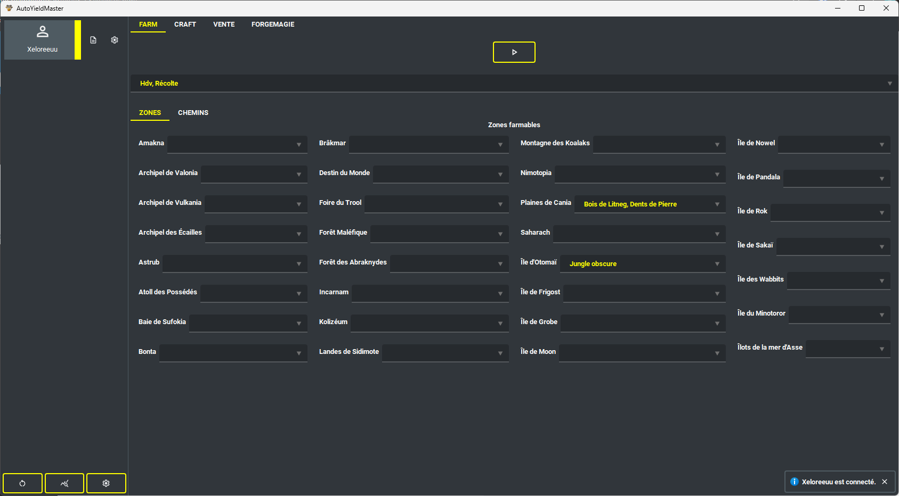

# Utilisation

### Présentation

AutoYieldMaster est un bot full pixel, donc il ne marche qu'a travers l'analyse d'image et la simulation de clique, il marche en arrière plan sauf si vous voulez farmer les monstres à travers le mode combat.

Le bot peux :
- Farmer les ressources récoltables (Paysan, Bucheron, Alchimiste, Pêcheur)
- Craft à travers les métiers (Paysan, Bucheron, Alchimiste, Pêcheur)
- Vendre des ressources ou consommables
- Automatiser la forgemagie d'exo

### Pré-requis
- Windows
- Afficher la barre des pods
- Connexion au choix de personnage
- Anticrénélage: aucun
- Limite de passage en mode créature: aucun
- Ne pas cocher afficher les personnages en transparence
- Afficher les coordonnées de la carte
- Mode tactique
- Ne pas cocher utiliser le mode tactique coloré
- Ne pas cocher afficher les cartes adjacentes
- Ne pas cocher afficher tous les monstres d'un groupe
- Mise à l'echelle 100% paramètre affichage pc
- Résolution 1920x1080
- Ne pas avoir d'écran dupliquer

### Jeu
- Ne pas être dans le tutoriel
- Etre abonné
- Avoir le zaap de bonta

### Télécharger la dernière version

https://github.com/Valentin-alix/AutoYieldMaster/releases/download/0.1/auto-yield-master-win64.zip

# Development

## Configuration

### Create .env:

Create .env file based on .env.template

### Install dependencies:
- `pip install poetry`
- `bash scripts/init.sh`

## Production:

### Generate obfucasted .exe
`pyi-makespec --noconsole --hidden-import "pkg_resources.extern" --add-data "./resources":"./resources" --add-data ".env":"." main.py && mkdir -p dist/ && pyarmor gen --pack main.spec -r main.py dist/`

## Profiling:

### Profile in RealTime:
`python -m cProfile -o scripts/helper/output/benchmark.pstats main.py`

### Display stat results
We need dot command :

- Install graphviz & put bin on path variable
  https://graphviz.org/download/

`gprof2dot -f pstats scripts/helper/output/benchmark.pstats | dot -Tpng -o scripts/helper/output/benchmark_output.png`

### Memory profiler
`mprof run main.py`
`mprof plot`